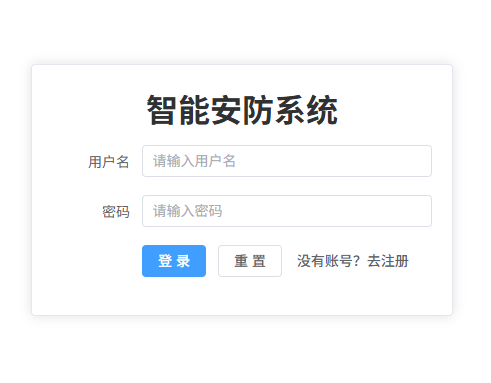
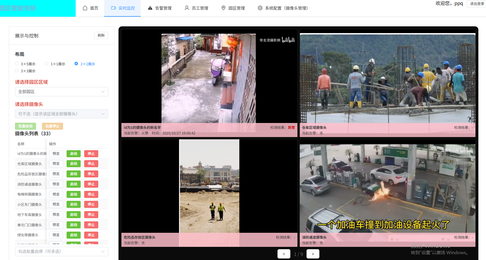
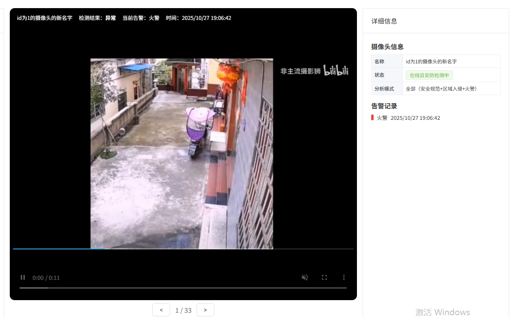
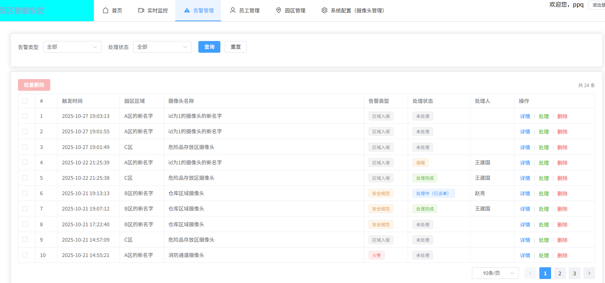
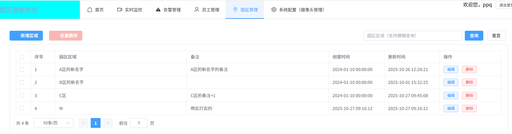
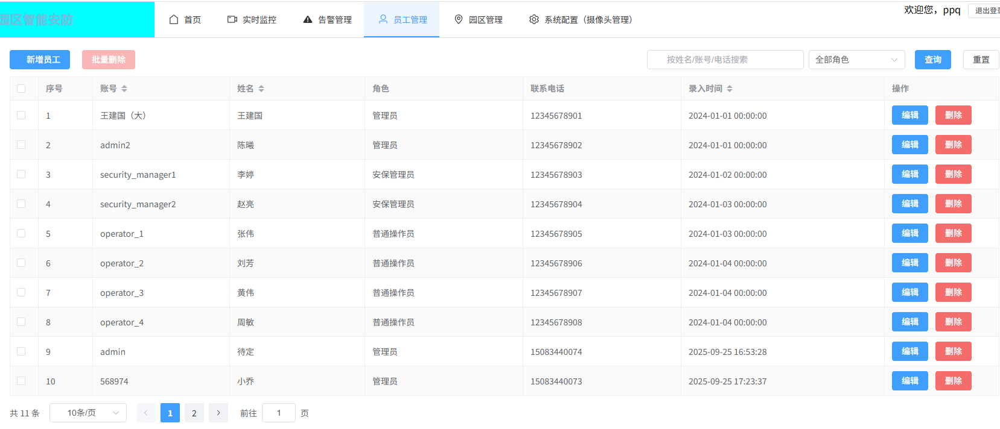
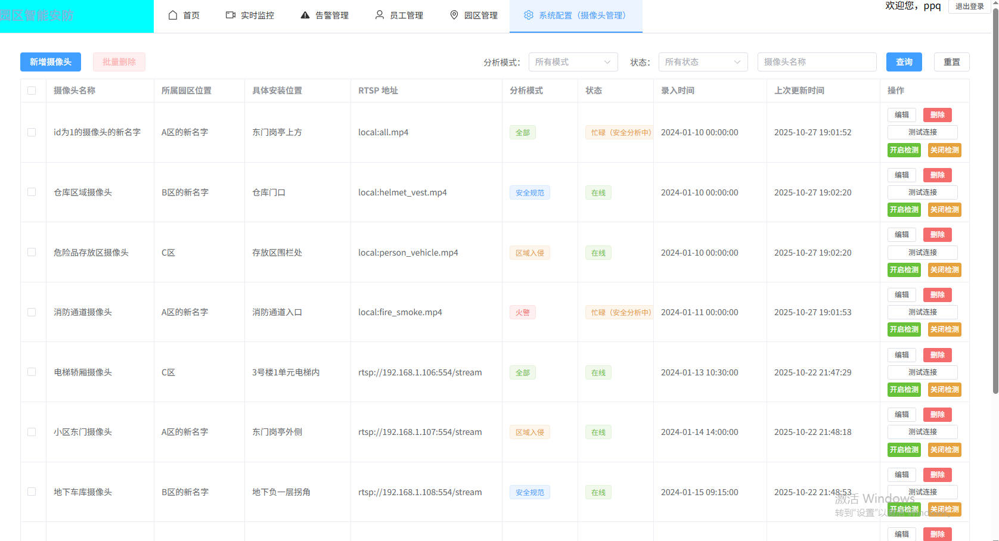
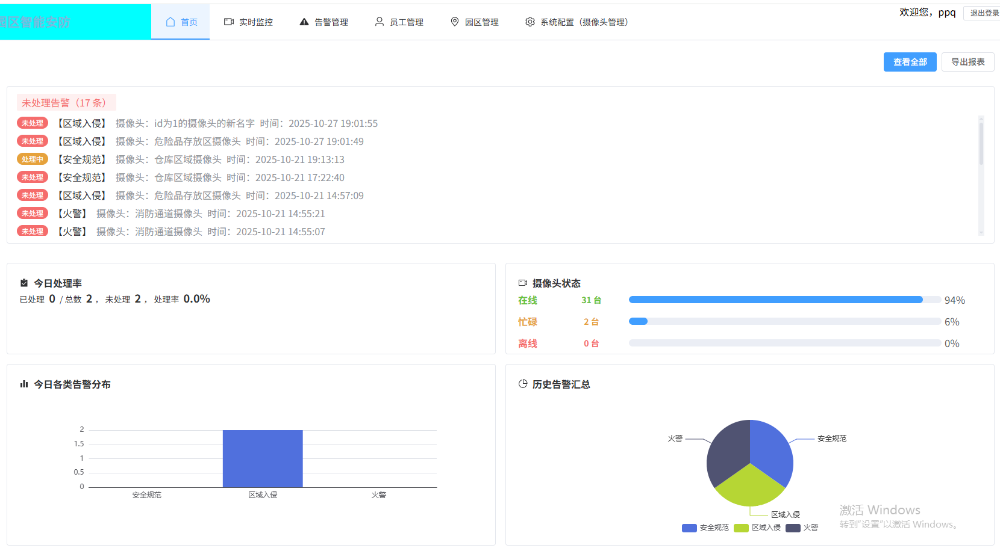

# 园区智能安防系统前端

## 项目信息
- **前端仓库地址**: [https://github.com/ppq4903/FontEnd-SmartSafetyGuardSystemForParK.git](https://github.com/ppq4903/FontEnd-SmartSafetyGuardSystemForParK.git)
- **后端仓库地址**: [https://github.com/ppq4903/SmartSafetyGuardSystemForPark.git](https://github.com/ppq4903/SmartSafetyGuardSystemForPark.git)

## 项目简介
这是一个基于Vue 3 + Element Plus开发的现代化园区智能安防系统前端界面，专为企业园区、工厂、社区等场所的安全监控需求设计。系统提供直观的操作界面和完整的功能模块，帮助安全管理人员高效地进行监控管理和告警处理。



### 前后端架构说明
本项目采用前后端分离架构：
- **前端**：基于Vue 3构建的单页应用，负责用户界面展示和交互
- **后端**：基于Python构建的RESTful API服务，负责业务逻辑处理和数据存储
- **数据交互**：前后端通过HTTP请求进行数据交换，采用JSON格式
- **WebSocket**：用于实时监控数据推送和告警通知
- **认证机制**：基于JWT的Bearer Token认证系统

### 项目背景
随着视频监控技术的快速发展，传统的监控系统已经无法满足现代安全管理的需求。本系统旨在构建一个集成度高、操作简便、功能完善的安防管理平台，实现监控视频实时查看、智能告警识别、高效处理流程等功能，提升安全管理的效率和响应速度。

### 主要价值
- **提升管理效率**：集中管理多区域摄像头，减少人工巡检成本
- **快速响应处理**：告警实时推送，快速响应和处理安全事件
- **数据可视化**：直观展示监控数据和告警信息
- **完善认证**：基于JWT的身份认证系统，确保系统安全
- **权限管理**：完善的用户角色权限控制，保障系统安全
- **历史追溯**：记录告警处理全过程，便于事后分析和追溯

## 功能模块

### 1. 认证系统
**确保系统安全，控制访问权限**

- 基于JWT的登录认证机制
- Bearer Token请求头认证
- 路由级权限控制，保护敏感页面
- 自动拦截未授权访问并重定向到登录页面
- 安全的退出登录功能，清除用户凭证

### 2. 实时监控模块
**系统核心功能，用于实时查看摄像头监控画面**
- 摄像头列表展示，直观显示每个摄像头的在线/离线状态
- 支持多摄像头画面同时预览，方便全面监控
- 提供多种画面布局选择（1x1, 2x2, 3x3等），根据需要灵活切换
- 按园区区域筛选摄像头，快速定位特定区域的监控画面
- 支持实时监控视频流播放





### 3. 告警管理模块
**用于管理和处理系统检测到的各类安全告警**
- 提供多条件告警查询（按告警类型、处理状态等）
- 告警详情查看，包括告警时间、位置、截图等信息
- 三种告警处理方式：
  - 派单处理：将告警分配给具体操作人员
  - 确认误报：标记为误触发的告警
  - 处理完成：标记已解决的告警
- 完整记录告警处理全过程，支持历史追溯
- 支持上传和下载处理附件（如处理照片、文档等）



### 4. 园区管理模块
**管理监控覆盖的物理区域信息**
- 添加、编辑、删除园区区域信息
- 为不同区域设置名称和标识
- 区域映射配置，建立物理区域与摄像头的关联关系
- 可视化展示园区结构



### 5. 员工管理模块
**管理系统操作人员信息和权限**
- 员工信息的添加、编辑、查询和删除
- 员工角色分配，包括三种角色：
  - 管理员：拥有最高权限，可管理所有功能
  - 安保管理员：负责告警处理和监控管理
  - 普通操作员：只能执行基础操作
- 密码重置功能，确保账户安全



### 6. 系统配置模块
**管理系统基础配置信息**
- 摄像头信息的增删改查
- 摄像头参数配置（如位置、分析模式等）
- 系统其他基础参数设置
- 摄像头管理功能



### 7. 数据统计与报表
**提供系统运行数据的统计和可视化展示**
- 今日告警记录统计报表
- 告警处理率统计
- 系统日志统计
- 基于ECharts的数据可视化展示



## 技术栈

### 前端框架
- **Vue 3** - 渐进式JavaScript框架（v3.2.38）
- **Element Plus** - Vue 3组件库（v2.4.4）
- **Element Plus Icons** - 图标库（v2.3.2）
- **Vite** - 现代化前端构建工具（v3.0.9）

### 数据请求与处理
- **Axios** - 基于Promise的HTTP客户端（v1.7.2）
- **WebSocket** - 实时通信支持

### 路由与状态管理
- **Vue Router** - Vue官方路由管理器（v4.1.5）
- **LocalStorage** - 客户端数据持久化存储

### 数据可视化
- **ECharts** - 交互式图表库（v6.0.0）

### 开发工具与规范
- **ESLint** - 代码质量检查工具（v8.22.0）
- **Prettier** - 代码格式化工具（v2.7.1）
- **Vue ESLint Config** - Vue特定的ESLint配置

## 项目结构

```
src/
├── api/           # API接口模块（按功能分类）
│   ├── alarm.js   # 告警相关接口
│   ├── area.js    # 园区相关接口
│   ├── camera.js  # 摄像头相关接口
│   ├── emp.js     # 员工相关接口
│   ├── login.js   # 登录认证接口
│   └── ...
├── assets/        # 静态资源文件
├── router/        # 路由配置（含路由守卫）
│   └── index.js
├── utils/         # 工具函数
│   ├── request.js # Axios请求封装（含认证拦截）
│   └── ws.js      # WebSocket工具
├── views/         # 页面组件
│   ├── alarm/     # 告警管理
│   ├── area/      # 园区管理
│   ├── emp/       # 员工管理
│   ├── home/      # 首页
│   ├── layout/    # 布局组件
│   ├── login/     # 登录页面
│   ├── monitor/   # 实时监控
│   ├── report/    # 报表统计
│   ├── sys/       # 系统配置
│   └── ...
├── App.vue        # 根组件
└── main.js        # 入口文件
```

## 认证与安全机制

### 认证流程
1. 用户通过登录页面提交用户名和密码
2. 后端验证凭据并返回JWT Token
3. 前端存储Token到LocalStorage
4. 后续请求通过Axios拦截器自动添加Authorization请求头
5. 路由守卫检查用户认证状态，保护敏感页面

### 路由保护
- 所有需要认证的路由都配置在主框架路由下，继承父路由的认证要求
- 路由守卫通过检查LocalStorage中的Token判断用户登录状态
- 未登录用户尝试访问受保护页面时，自动重定向到登录页面

### 安全特性
- 防止未授权访问核心功能页面
- 退出登录时清除所有用户凭证
- 使用标准的Bearer Token认证格式
- 完善的错误处理和用户提示

## 关键API接口

### 认证相关
- `POST /api/login` - 用户登录，获取认证Token
- `POST /api/logout` - 用户登出

### 告警管理
- `GET /api/alarm/list` - 获取告警列表
- `GET /api/alarm/detail/:id` - 获取告警详情
- `PUT /api/alarm/process/:id` - 处理告警

### 园区管理
- `GET /api/area/list` - 获取园区区域列表
- `POST /api/area` - 创建新区域
- `PUT /api/area/:id` - 更新区域信息
- `DELETE /api/area/:id` - 删除区域

### 员工管理
- `GET /api/emp/list` - 获取员工列表
- `POST /api/emp` - 添加员工
- `PUT /api/emp/:id` - 更新员工信息
- `DELETE /api/emp/:id` - 删除员工

### 摄像头管理
- `GET /api/camera/list` - 获取摄像头列表
- `POST /api/camera` - 添加摄像头
- `PUT /api/camera/:id` - 更新摄像头信息
- `DELETE /api/camera/:id` - 删除摄像头

## 新手从零开始部署指南

### 第一步：安装Node.js环境

#### Windows系统
1. 访问 [Node.js官网](https://nodejs.org/zh-cn/)
2. 下载最新的稳定版（LTS）安装包
3. 双击安装包，按照提示完成安装（注意勾选"Add to PATH"选项）
4. 安装完成后，按 `Win + R` 键，输入 `cmd` 打开命令提示符
5. 分别执行以下命令验证安装成功：
   ```cmd
   node -v
   npm -v
   ```
   如果能显示版本号，说明安装成功

#### macOS系统
1. 方法一：通过官网安装
   - 访问 [Node.js官网](https://nodejs.org/zh-cn/)
   - 下载最新的稳定版（LTS）安装包
   - 双击安装包完成安装

2. 方法二：通过Homebrew安装（推荐）
   - 打开终端（Terminal）
   - 如果没有Homebrew，先安装：
     ```bash
     /bin/bash -c "$(curl -fsSL https://raw.githubusercontent.com/Homebrew/install/HEAD/install.sh)"
     ```
   - 安装Node.js：
     ```bash
     brew install node
     ```
   - 验证安装：
     ```bash
     node -v
     npm -v
     ```

#### Linux系统（Ubuntu/Debian）
1. 打开终端
2. 更新软件包列表：
   ```bash
   sudo apt update
   ```
3. 安装Node.js和npm：
   ```bash
   sudo apt install nodejs npm
   ```
4. 验证安装：
   ```bash
   node -v
   npm -v
   ```

### 第二步：克隆项目代码

#### 使用Git（推荐）
1. 如果没有Git，先安装Git
   - Windows：访问 [Git官网](https://git-scm.com/) 下载安装
   - macOS：`brew install git`
   - Linux：`sudo apt install git`

2. 克隆项目代码：
   ```bash
   git clone https://github.com/ppq4903/FontEnd-SmartSafetyGuardSystemForParK.git
   cd FontEnd-SmartSafetyGuardSystemForParK
   ```

#### 直接下载ZIP包
1. 从代码仓库下载项目ZIP压缩包
2. 解压到本地文件夹
3. 进入解压后的文件夹

### 第三步：安装项目依赖

1. 打开命令行工具，进入项目根目录
2. 执行以下命令安装依赖：
   ```bash
   npm install
   ```

   > **注意事项：**
   > - 这一步可能需要几分钟时间
   > - 如果遇到权限问题，Windows可以用管理员权限打开命令提示符，Linux/macOS可以在命令前加 `sudo`
   > - 如果遇到网络问题，可以考虑使用淘宝镜像：
   >   ```bash
   >   npm install --registry=https://registry.npmmirror.com
   >   ```

### 第四步：配置后端API地址

1. 在启动项目前，确保已配置正确的后端API地址
2. 修改 `src/utils/request.js` 中的API基础路径，指向实际的后端服务地址

### 第五步：启动开发服务器

1. 安装完成后，执行以下命令启动开发服务器：
   ```bash
   npm run dev
   ```

2. 启动成功后，命令行会显示访问地址：
   ```
   http://localhost:5173/
   ```

3. 打开浏览器，访问显示的地址即可查看项目
4. 首次访问会自动跳转到登录页面，需要使用有效凭据登录系统

### 第六步：构建生产版本（可选）

如果需要部署到生产环境：

1. 执行构建命令：
   ```bash
   npm run build
   ```

2. 构建完成后，项目根目录会生成 `dist` 文件夹
3. 将 `dist` 文件夹中的所有文件部署到Web服务器即可

## 认证系统使用说明

### 登录认证流程
1. 访问系统首页，系统会自动重定向到登录页面
2. 输入用户名和密码进行登录
3. 登录成功后，系统会：
   - 保存JWT Token到浏览器LocalStorage
   - 重定向到系统主页面
   - 在后续请求中自动携带认证信息

### 权限管理
- 系统实现了基于路由的权限控制
- 未登录用户无法访问受保护的功能页面
- 不同角色的用户拥有不同的操作权限

### 退出登录
- 点击右上角的"退出登录"按钮
- 系统会清除存储的Token和用户信息
- 自动重定向到登录页面

## 常见问题及解决方案

1. **npm install 失败**
   - 检查网络连接
   - 尝试使用淘宝镜像
   - 清理npm缓存：`npm cache clean --force`

2. **启动后无法访问**
   - 检查端口是否被占用
   - 尝试关闭防火墙或允许Node.js通过防火墙

3. **页面空白或报错**
   - 确认依赖安装完整
   - 检查浏览器控制台的错误信息
   - 确保后端服务已启动并正常运行

4. **登录失败或认证错误**
   - 检查用户名和密码是否正确
   - 确认后端认证服务正常运行
   - 检查Token有效期和格式是否正确

5. **构建失败**
   - 检查项目中是否有语法错误
   - 查看构建日志中的具体错误信息

## 开发工具推荐

### 编辑器
- [VSCode](https://code.visualstudio.com/) - 推荐的代码编辑器

### 推荐插件
- Volar - Vue 3 支持插件
- ESLint - 代码质量检查
- Prettier - 代码格式化
- Chinese (Simplified) Language Pack - 中文语言包（可选）
- Auto Close Tag - 自动闭合HTML标签

## 接口规范

### API路径约定
- 后端接口采用RESTful风格
- 路径使用snake_case命名规范
- 接口返回统一格式的JSON数据

### 请求认证
- 所有需要认证的API请求必须在请求头中包含：
  ```
  Authorization: Bearer {token}
  ```
- 未携带有效Token的请求将返回401错误

### 错误处理
- 401错误：未认证或Token无效/过期
- 403错误：没有权限执行此操作
- 404错误：接口路径不存在
- 422错误：请求参数验证失败
- 500错误：服务器内部错误

## 项目运行流程
1. 用户访问应用，首先加载index.html
2. index.html加载src/main.js，初始化Vue应用
3. 路由守卫检查用户认证状态
4. 未登录用户重定向到登录页面，已登录用户根据URL路由显示对应页面
5. 页面组件通过API模块与后端交互获取数据
6. 数据通过Vue的响应式系统更新到页面上

## 浏览器兼容性
- 支持Chrome 90+
- 支持Firefox 88+
- 支持Safari 14+
- 支持Edge 90+

## 注意事项
1. 开发时请确保后端服务正常运行
2. 上传附件大小限制为10MB
3. 请使用较新版本的浏览器获得最佳体验
4. 定期清理浏览器缓存，避免因缓存导致的认证问题
5. 敏感操作前请确认当前用户权限

## 许可证
本项目仅供内部使用

## 开发团队
安防系统开发小组

## 更新日志

### v1.1.0
- 增强认证系统，实现基于JWT的安全登录机制
- 优化路由保护逻辑，防止未授权访问
- 完善退出登录功能，确保用户凭证安全清除
- 更新导航菜单，修复路由跳转问题
- 优化系统布局和用户体验

### v1.0.0
- 初始版本发布
- 实现核心功能模块（实时监控、告警管理、园区管理、员工管理、系统配置）
- 完成基础界面开发
- 集成Element Plus组件库和ECharts数据可视化